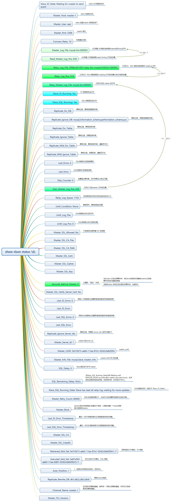

# 5.7 MySQL多主一从

基于`docker-compse` + `mysql gtid` 模式的一主多从，还包括故障处理。

#### 目录结构：

```powershell
➜  n-master_1-slave tree ./
./
├── conf
│   ├── master-1
│   │   └── master-1.cnf
│   ├── master-2
│   │   └── master-2.cnf
│   └── slave
│       └── slave.cnf
├── docker-compose.yml
```

#### master-1.cnf:

```properties
[mysqld]
server_id = 1
gtid_mode = on
enforce_gtid_consistency = on
log-bin = mysql-bin
log-slave-updates = 1
binlog_format = ROW
skip-slave-start = 1
character-set-server = utf8mb4
collation-server = utf8mb4_unicode_ci
```

#### master-2.cnf:

```properties
[mysqld]
server_id = 2
gtid_mode = on
enforce_gtid_consistency = on
log-bin = mysql-bin
log-slave-updates = 1
binlog_format = ROW
skip-slave-start = 1
character-set-server = utf8mb4
collation-server = utf8mb4_unicode_ci
```

#### slave.cnf:

```properties
[mysqld]
server_id = 666
gtid_mode = on
enforce_gtid_consistency = on
log-bin = mysql-bin
log-slave-updates = 1
binlog_format = ROW
skip-slave-start = 1
binlog-ignore-db = mysql
binlog_ignore_db = information_schema
binlog_ignore_db = performation_schema
binlog_ignore_db = sys
character-set-server = utf8mb4
collation-server = utf8mb4_unicode_ci
master_info_repository  = table
relay_log_info_repository = table
```

#### docker-compose.yml:

```yaml
version: '3.5'
services:
  master-1:
    image: mysql:5.7
    container_name: mysql-master-1
    environment:
      - "MYSQL_ROOT_PASSWORD=root"
    volumes:
      - master-1-data:/var/lib/mysql
      - ./conf/master-1:/etc/mysql/conf.d/
  master-2:
    image: mysql:5.7
    container_name: mysql-master-2
    environment:
      - "MYSQL_ROOT_PASSWORD=root"
    volumes:
      - master-2-data:/var/lib/mysql
      - ./conf/master-2:/etc/mysql/conf.d/
  slave:
    image: mysql:5.7
    container_name: mysql-slave
    environment:
      - "MYSQL_ROOT_PASSWORD=root"
    volumes:
      - slave-data:/var/lib/mysql
      - ./conf/slave:/etc/mysql/conf.d/
volumes:
  master-1-data:
  master-2-data:
  slave-data:
```

#### 启动

```powershell
cd n-master_1-slave
# 将配置文件设置为 0444 权限，否则mysql 认为 World-writable config file，将忽略改配置文件
➜ chmod 0444 conf/master-1/master-1.cnf
➜ chmod 0444 conf/master-2/master-2.cnf
➜ chmod 0444 conf/slave/slave.cnf

# 启动
➜ docker-compose up -d
Creating network "n-master_1-slave_default" with the default driver
...

# 查看下docker 容器
➜ docker ps

# 分别进入2个 master 容器建立下复制账户 repl
# master-1 容器
➜ docker exec -it mysql-master-1 bash
root@a54575fe08af:/# mysql -uroot -p
mysql> GRANT REPLICATION SLAVE ON *.* TO 'repl'@'%' IDENTIFIED BY 'repl';

# master-2 容器
➜ docker exec -it mysql-master-2 bash
root@4b1ef0d49885:/# mysql -uroot -p
mysql> GRANT REPLICATION SLAVE ON *.* TO 'repl'@'%' IDENTIFIED BY 'repl';

# slave 服务 设置主从配置，并启动 slave
➜  n-master_1-slave docker exec -it mysql-slave bash
root@b6d19b9c202c:/# mysql -uroot -p

# 作为 master-1 的从服务
mysql> CHANGE MASTER TO MASTER_HOST='master-1', 
MASTER_USER='repl',
MASTER_PASSWORD='repl', 
MASTER_PORT=3306, 
MASTER_AUTO_POSITION=1, 
MASTER_CONNECT_RETRY=10 
for channel 'master-1';

# 作为 master-2 的从服务
mysql> CHANGE MASTER TO MASTER_HOST='master-2', 
MASTER_USER='repl',
MASTER_PASSWORD='repl', 
MASTER_PORT=3306, 
MASTER_AUTO_POSITION=1, 
MASTER_CONNECT_RETRY=10 
for channel 'master-2';

# 启动所有 slave (也可单独对channel 启用：start slave for channel 'master-1')
mysql> start slave;

# 查看slave状态，关注下：Slave_IO_Running, Slave_SQL_Running, Last_Error,  Seconds_Behind_Master : 主从延时
mysql> show slave status \G;

```

#### 测试同步

```mysql
# master-1
> create database test1;
> use test1;
> create table a(id int not null primary key, name varchar(20));
> insert a(id, name) values(1, 'zhangsan');

# master-2
> create database test2;
> use test2;
> create table b(id int not null primary key , name varchar(20));
> insert b(id, name) values(1, 'java');

# slave 查看
> show databases;
> use test1;
> show tables;
> select * from a;

> use test2;
> show tables;
> select * from b;
```

#### GTID模式下同步故障处理
##### 1. 主库新增记录，从库提示主键冲突

模拟故障场景：

主库

```mysql
insert into a(id, name) values(5, 'php');
set sql_log_bin=0; # 关闭binlog 输出，即以下操作，不会同步(会话级别)
delete from a where id = 5; # 主库无 id为 5的记录，从库还存在id为5的记录
set sql_log_bin=1; # 恢复binlog 同步
insert into a(id, name) values(5, 'php'); # 再次插入id 为5的记录，主库ok，从库报错
```

从库

```mysql
show status for channel 'master-1';
...
Last_Errno: 1062
Last_Error: Could not execute Write_rows event on table test1.a; Duplicate entry '5' for key 'PRIMARY', Error_code: 1062; handler error HA_ERR_FOUND_DUPP_KEY; the event's master log mysql-bin.000009, end_log_pos 1330
```

解决办法：

```mysql
# 根据错误信息，在从库上删除对应记录即可
stop slave  for channel 'master-1';
delete from test1.a where id = 5;
start slave for channel 'master-1';
show slave status for channel 'master-1' \G;
```

##### 2. 主库对象可更新，从库无对应对象可更新

模拟故障场景：

主库

```mysql
insert into a(id, name) values(12, 'javascript'), (13, 'python');
```

从库

```mysql
delete from a where id = 13;
```

主库

```mysql
update a set name = 'golang' where id = 13;  # 从库同步此条执行时，找不到id为13的记录
```

从库查看故障

```mysql
show slave status for channel 'master-1' \G;
Last_Errno: 1032
Last_Error: Could not execute Update_rows event on table test1.a; Can't find record in 'a', Error_code: 1032; handler error HA_ERR_KEY_NOT_FOUND; the event's master log mysql-bin.000009, end_log_pos 1887
```

解决办法：

```mysql
# 上面的错误信息能看出来是在更新哪个表， 错误码， binlog 及其位置，但不知道具体更新什么
# 在 master 上，用mysqlbinlog 分析下出错的binlog日志在干什么
# 主库主机
cd /var/lib/mysql
mysqlbinlog --no-defaults --base64-output=DECODE-ROWS -v mysql-bin.000009 | grep -A 30 'end_log_pos 1887'
#200614 10:54:34 server id 1  end_log_pos 1887 CRC32 0x17b2ee7b 	Update_rows: table id 110 flags: STMT_END_F
### UPDATE `test1`.`a`
### WHERE
###   @1=13
###   @2='python'
### SET
###   @1=13
###   @2='golang'
# at 1887
#200614 10:54:34 server id 1  end_log_pos 1918 CRC32 0x1ca9f6f6 	Xid = 177
COMMIT/*!*/;
SET @@SESSION.GTID_NEXT= 'AUTOMATIC' /* added by mysqlbinlog */ /*!*/;
DELIMITER ;
# End of log file
/*!50003 SET COMPLETION_TYPE=@OLD_COMPLETION_TYPE*/;
/*!50530 SET @@SESSION.PSEUDO_SLAVE_MODE=0*/;

# 可以看出 在执行更新 test1.a 表， where: 列1=13, 列2='python', 更新为 : 列1=13, 列2='golang'
# 从主库查出数据，用于将其补充到 slave 上
select * from test1.a where id = 13;

# 从库
stop slave for channel 'master-1';
insert into test1.a(id, name) values(13, 'golang');
start slave for channel 'master-1';
show slave status for channel 'master-1' \G;
```


##### 3. 主库对象可删除，从库无对象可删除

模拟故障场景:
主库

```sql
insert into a(id, name) values(2, 'php');
```
从库
```sql
delete from a where id = 2;
```
主库
```sql
delete from a where id = 2;
```
从库查看故障
```mysql
show slave status for channel 'master-1' \G;
...
Last_Errno: 1032
Last_Error: Could not execute Delete_rows event on table test1.a; Can't find record in 'a', Error_code: 1032; handler error HA_ERR_END_OF_FILE; the event's master
```
解决办法：
```mysql
# 由于master 要删除一条记录，而slave上找不到故报错,这种情况主库都将其删除了，那么从库可直接跳过：

# gtid 模式下，通过注入空事务来跳过
stop slave for channel 'master-1';
set gtid_next='c8f46ba5-ad7f-11ea-8d95-0242ac140002:18'; 
# 此处的gtid 通过 
show slave status for channel 'master-1'  \G;  
# 来确认，Retrieved_Gtid_Set 与 Executed_Gtid_Set， 接收的和已执行的结合起来看

begin;commit;
set gtid_next='AUTOMATIC';
start slave for channel 'master-1';
# 

# 或者提前在 slave my.cnf 中配置 忽略 1032 错误，需重启 （gtid、非gtid模式都通用）
slave-skip-errors = 1032
```

##### 4. 主库日志被purged

注意即使恢复主从同步，数据也会不一致

模拟故障场景

首先停止从库，模拟从库宕机

```mysql
slave slave;
```

主库，制造数据生成binlog

```mysql
insert into a(id, name) values(3, 'a');
flush logs;
delete from a where id = 3;
insert into a(id, name) values(4, 'b');
insert into a(id, name) values(5, 'c');
insert into a(id, name) values(6, 'd');
flush logs;
insert into a(id, name) values(7, 'e');
insert into a(id, name) values(8, 'f');
insert into a(id, name) values(9, 'g');
delete from a;
insert into a(id, name) values(10, 'h');
flush logs;
```

主库，清理binlog

```mysql
show binary logs; # 查看最新的binlog 文件到哪个了， purge binary logs to保留至最后一个
+------------------+-----------+
| Log_name         | File_size |
+------------------+-----------+
| mysql-bin.000006 |       177 |
| mysql-bin.000007 |   3071539 |
| mysql-bin.000008 |      1056 |
| mysql-bin.000009 |       818 |
+------------------+-----------+

purge binary logs to 'mysql-bin.000009';
show binary logs; # 再次查看
show variables like '%gtid_purge%'; # 此时的 gtid_purged
+---------------+-------------------------------------------+
| Variable_name | Value                                     |
+---------------+-------------------------------------------+
| gtid_purged   | c8f46ba5-ad7f-11ea-8d95-0242ac140002:1-28 |
+---------------+-------------------------------------------+
1 row in set (0.00 sec)
```

启动从库

```mysql
start slave for channel 'master-1';
show slave status for channel 'master-1' \G;
...
               Last_IO_Errno: 1236
                Last_IO_Error: Got fatal error 1236 from master when reading data from binary log: 'The slave is connecting using CHANGE MASTER TO MASTER_AUTO_POSITION = 1, but the master has purged binary logs containing GTIDs that the slave requires. Replicate the missing transactions from elsewhere, or provision a new slave from backup. Consider increasing the master's binary log expiration period. The GTID sets and the missing purged transactions are too long to print in this message. For more information, please see the master's error log or the manual for GTID_SUBTRACT.'
                
show variables like '%gtid_purge%'; # 此时从库的 gtid_purged                
+---------------+-------+
| Variable_name | Value |
+---------------+-------+
| gtid_purged   |       |
+---------------+-------+
1 row in set (0.00 sec)
```

解决办法：

```mysql
# 尝试使用 gtid_purged 进行跳过事务
stop slave for channel 'master-1';
set global gtid_purged = 'c8f46ba5-ad7f-11ea-8d95-0242ac140002:1-28';
ERROR 1840 (HY000): @@GLOBAL.GTID_PURGED can only be set when @@GLOBAL.GTID_EXECUTED  is empty.

# 提示只有当 GLOBAL.GTID_EXECUTED 为空时，才可以设置 GLOBAL.GTID_PURGED, 我们看下 GTID_EXECUTED
show global variables like 'gtid_executed';
+---------------+--------------------------------------------------------------------------------------------------------------------------------+
| Variable_name | Value                                                                                                                          |
+---------------+--------------------------------------------------------------------------------------------------------------------------------+
| gtid_executed | c8f46ba5-ad7f-11ea-8d95-0242ac140002:1-18,
c9a23c85-ad7f-11ea-a3e6-0242ac140005:1-3,
ca203851-ad7f-11ea-b813-0242ac140003:1-12 |
+---------------+--------------------------------------------------------------------------------------------------------------------------------+
1 row in set (0.00 sec)

# 清空从库的 gitd_executed , 再次设置 purged
reset master ;
set global gtid_purged = 'c8f46ba5-ad7f-11ea-8d95-0242ac140002:1-28';
start slave for channel 'master-1';
show slave status for channel 'master-1' \G;
```

##### 5. slave的中继日志relay-bin损坏

模拟故障场景：

主库

```mysql
# 创建测试表
create table t_col like information_schema.columns;
```

从库

```mysql
# 停掉 sql_thread
stop  slave sql_thread for channel 'master-1';
```

主库

```mysql
# 主库制造一些数据	
flush logs;
insert into t_col select * from  information_schema.columns;
insert into t_col select * from  information_schema.columns;
insert into t_col select * from  information_schema.columns;
flush logs;
```

从库

```mysql
# bash 删除中继日志
cd /var/lib/mysql
rm -rf *-relay-bin-*
mysql -root -p

start slave sql_thread for channel 'master-1';
show slave status for channel 'master-1' \G;
...
Last_Errno: 1594
Last_Error: Relay log read failure: Could not parse relay log event entry. The possible reasons are: the master's binary log is corrupted (you can check this by running 'mysqlbinlog' on the binary log), the slave's relay log is corrupted (you can check this by running 'mysqlbinlog' on the relay log), a network problem, or a bug in the master's or slave's MySQL code. If you want to check the master's binary log or slave's relay log, you will be able to know their names by issuing 'SHOW SLAVE STATUS' on this slave.
# 如发现不是1594 错误，而是1677 ，可以参考下面的 5. 其他错误


```

解决方法：

```mysql
show slave status for channel 'master-1' \G;

# 1. 确认同步的binlog 和 POS 点 （IO线程）
# Slave_IO_Running: # 接收master的binlog信息
# Master_Log_file/Read_Master_Log_Pos: 显示当前读取的Master节点binlog文件和位置

# 2. Slave_SQL_Running : 执行写操作 （SQL 线程）
# Relay_Log_File/Relay_Log_Pos: 显示当前Slave节点正在处理的中继日志文件和位置
# Relay_Master_Log_File/Exec_Master_Log_Pos: 显示当前slave节点正在处理的中继日志文件和位置 在Master 中对应的binlog文件和位置。
*************************** 1. row ***************************
               Slave_IO_State: Waiting for master to send event
                  Master_Host: master-1
                  Master_User: repl
                  Master_Port: 3306
                Connect_Retry: 10
              Master_Log_File: mysql-bin.000010 # f1-a 读取到了 这个文件
          Read_Master_Log_Pos: 1474235 # f1-b 读取到位置
               Relay_Log_File: 1b0e523461ab-relay-bin-master@002d1.000007 # f2-a处理的relaylog 文件
                Relay_Log_Pos: 407 # f2-b 处理好的位置， 407 位置及之前的都已经入库了
        Relay_Master_Log_File: mysql-bin.000010 # f3-a 此时 relaylog 对应 Master 的binlog 文件
             Slave_IO_Running: Yes
            Slave_SQL_Running: No
......
          Exec_Master_Log_Pos: 194 #  f3-b 此时 relaylog 对应 Master 的binlog 文件的位置
# 以上有 3对 文件-位置，f1-a/b, f2-a/b, f3-a/b
# 我们将 master 上 mysql-bin.000010 文件 的 194 之后的binlog 内容抽取过来即可

# 重新同步
stop slave  for channel 'master-1' ;
CHANGE MASTER TO MASTER_LOG_FILE='mysql-bin.000010', MASTER_LOG_POS=194, MASTER_AUTO_POSITION=0 for channel 'master-1';
start slave for channel 'master-1';
show slave status for channel 'master-1' \G;

# 切回自动 POS 方式， 当发现同步处理完成后-可根据延迟判断（非必须）
stop slave  for channel 'master-1' ;
CHANGE MASTER TO  MASTER_AUTO_POSITION=1 for channel 'master-1';
start slave for channel 'master-1';
show slave status for channel 'master-1' \G;
```

##### 6.其他错误

```mysql
Last_Errno: 1677
Last_Error: Column 0 of table 'test1.t_col' cannot be converted from type 'varchar(1536(bytes))' to type 'varchar(2048(bytes) utf8mb4)'
```

解决办法

```mysql
set global slave_type_conversions ='ALL_NON_LOSSY';
stop slave for channel 'master-1';
start slave for channel 'master-1';
show slave status for channel 'master-1' \G;
```

参考：[关于SQL_Errno:1677导致主从复制中断的思考和实践](https://www.cnblogs.com/mysql-dba/p/8820798.html)

不同数据类型的主从复制**：正常情况下，主库和从库每个表的各个列数据类型都是一致的，但是MySQL并不强制这样。

**属性升级和降级(attribute promotion and demotion)** 主从复制下，MySQL只支持**同类**小数据类型和较大类型之间的属性提升和降级，比如将主库上int在从库上转为bigint，视为属性升级，相反将bigint转为int就是属性降级。

**有损和无损转换(Lossy and non-lossy conversions)**：主从数据库同一表同一列数据类型不一致，会产生数据类型转换。为了符合和适应目标列类型，截断(或其他修改)源值，称为有损转换；不需要截断或类似的修改以适应目标列中的源列值的转换是一个非有损的转换。这两种转换模式主要由**slave_type_conversions**系统变量控制，该变量的值如下：

| **Mode**                                | **影响描述**                                                 |
| --------------------------------------- | ------------------------------------------------------------ |
| ALL_LOSSY（有损转换）                   | 该模式下，列类型转换允许丢失一些信息。如果只设置该模式，只允许同类的大数据类型转换为小数据类型，其他模式的转换都会发生1677错误。生产环境不建议设置该值，很容易导致主从不一致。 |
| ALL_NON_LOSSY（无损转换）               | 该模式下，不会导致数据丢失和截断，因为该值只允许同类的小数据类型转换为大数据类型，其他模式的转换都会发生1677错误。生产环境建议设置该值 |
| ALL_LOSSY,ALL_NON_LOSSY（两种情况并存） | 上面两种模式都支持，生产环境不建议设置该值                   |
| [*empty*] （空值）                      | 不设置任何值，表示不允许任何模式的类型转换，如果发现类型转换，都会产生1677错误，导致复制中断 |

#### 

#### 非GTID 模式下的同步故障处理

这里只是记录非GTID同步模式下单同步故障处理方式，没有将以上的配置改为非gtid模式。

切换可参考：[MySQL的GTID复制与传统复制的相互切换](https://www.cnblogs.com/wanbin/p/9899600.html)

##### 1. 主库新增记录，从库提示主键冲突

和GTID模式处理相同。

##### 2. 主库对象可更新，从库无对应对象可更新

和GTID模式处理相同。

##### 3. 主库对象可删除，从库无对象可删除

模拟故障场景，同GTID模式。

```mysql
# 下使用 sql_slave_skip_counter=1  跳过（1为跳过的错误个数，gtid模式不支持）
stop slave for channel 'master-1';
set global sql_slave_skip_counter=1;
start slave for channel 'master-1';
```

##### 4. slave的中继日志relay-bin损坏

和GTID模式处理相似，不用切回自动模式。

#### 环境清理

```bash
docker-compose down
docker volume prune
```

### 附录

#### 复制过滤
* [基于配置文件的过滤规则](https://dev.mysql.com/doc/refman/5.7/en/replication-options-slave.html#option_mysqld_replicate-ignore-db)
	* replicate-ignore-db=db_name  (由于数据库名称可以包含逗号，因此，如果提供逗号分隔的列表，则该列表将被视为单个数据库的名称。[官方文档](https://dev.mysql.com/doc/refman/5.7/en/replication-options-slave.html#option_mysqld_replicate-ignore-db))
	* replicate-ignore-table=db_name.tbl_name
	* replicate-wild-ignore-table=db_name.tbl_name
	* replicate-do-db=db_name
	* replicate-do-table=db_name.tbl_name
	* replicate-wild-do-table=db_name.%
	* replicate-rewrite-db=from_name->to_name
* 更改复制过滤器规则 - 在线动态 [change-replication-filter](https://dev.mysql.com/doc/refman/5.7/en/change-replication-filter.html)
	```mysql
	CHANGE REPLICATION FILTER filter[, filter][, ...]
		filter: {
			REPLICATE_DO_DB = (db_list)
			REPLICATE_IGNORE_DB = (db_list)
		  | REPLICATE_DO_TABLE = (tbl_list)
		  | REPLICATE_IGNORE_TABLE = (tbl_list)
		  | REPLICATE_WILD_DO_TABLE = (wild_tbl_list)
		  | REPLICATE_WILD_IGNORE_TABLE = (wild_tbl_list)
		  | REPLICATE_REWRITE_DB = (db_pair_list)
		}

		db_list:
			db_name[, db_name][, ...]

		tbl_list:
			db_name.table_name[, db_table_name][, ...]
		wild_tbl_list:
			'db_pattern.table_pattern'[, 'db_pattern.table_pattern'][, ...]

		db_pair_list:
			(db_pair)[, (db_pair)][, ...]

		db_pair:
			from_db, to_db
	```
* 基于复制通道的筛选器 ([MySQL 8.0](https://dev.mysql.com/doc/refman/8.0/en/replication-rules-channel-based-filters.html))

#### 命令集：

```mysql
> show global variables like '%gtid%';
> show binary logs;
> show binlog events in 'mysql-bin.000001';  # 查看该binlog event position
> show slave hosts;
> show processlist;
> show full processlist \G;
> show slave status \G;
> show slave status for channel 'master-1' \G;

# 启停 slave 相关
> start slave;
> start slave for channel 'master-1';
> start slave for channel 'master-1';
> stop slave io_thread;     
> start slave io_thread;
> stop slave sql_thread;
> start slave sql_thread;

> set gtid_next='xxxxxxx:n';
> begin; commit;
> set gtid_next='AUTOMATIC';
> set sql_log_bin=0; # 接下来的操作不会写入 binlog
> delete from a;
> set sql_log_bin=1;

> reset slave for channel 'master-2'; #使从服务器忘记其在主服务器二进制日志中的复制位置。该语句旨在用于全新启动：清除主信息和中继日志信息存储库，删除所有中继日志文件，并启动新的中继日志文件。

> purge binary logs to 'mysql-bin.000009';
> show binary logs;
> show variables like '%gtid_purge%';
> show global variables like 'gtid_executed';

> CHANGE MASTER TO MASTER_HOST='master-1', 
MASTER_USER='repl',
MASTER_PASSWORD='repl', 
MASTER_PORT=3306, 
MASTER_AUTO_POSITION=1, 
MASTER_CONNECT_RETRY=10 
for channel 'master-1';

> CHANGE MASTER TO MASTER_LOG_FILE='mysql-bin.000010', MASTER_LOG_POS=194, MASTER_AUTO_POSITION=0 for channel 'master-1';


# 在线修改过滤规则
> CHANGE REPLICATION FILTER REPLICATE_IGNORE_DB= (mysql,information_schema,performation_schema,sys);
```

#### show slave status \G; 参数解释：


